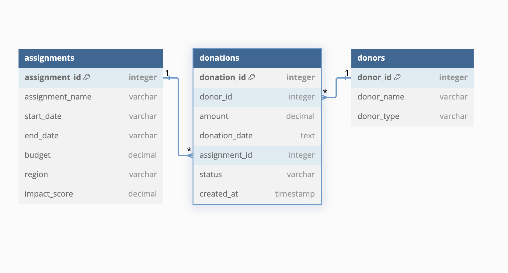

# goodthought-impact-analysis

# 📊 Impact Analysis of GoodThought NGO Initiatives

I built this project to explore how data can reveal the real-world impact of NGO efforts. Using SQL, I analyzed operations from **GoodThought**, a non-profit focused on education, healthcare, and sustainable development across underserved communities.

## 🌍 Project Background

The dataset spans from **2010 to 2023**, capturing detailed records of:

- **Assignments**: Each project’s name, timeline, region, budget, and impact score
- **Donations**: How funds were distributed across assignments and donor types
- **Donors**: Profiles of individuals and organizations supporting the cause

Here's the ERD diagram that maps out the relationships between these tables:  

## 🔍 What I Did

SQL queries to answer two key questions:

1. **Top Donation Assignments**  
   - Find the top five assignments based on total donation value  
   - Categorized by donor type  
   - Output includes assignment name, region, donation amount, and donor type

2. **Top Regional Impact Assignments**  
   - Identify the highest impact score assignment per region  
   - Only includes assignments with at least one donation  
   - Output includes assignment name, region, impact score, and total donations

## 💡 Why It Matters

This project goes beyond technical querying—it's about using data to understand how resources are being used and where they’re making the most difference. It’s a small but meaningful step toward smarter decision-making in the non-profit space.

---

